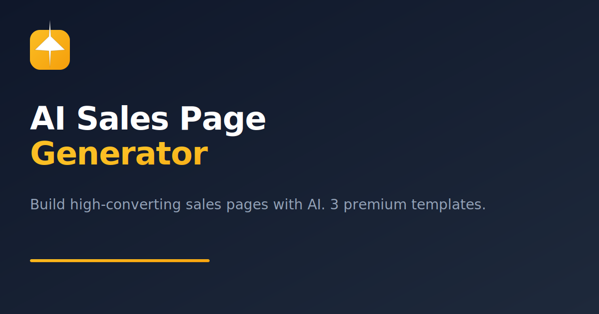

# 🚀 SalesAI — AI Sales Page Generator

**Build high-converting sales pages with AI. Choose from 3 premium templates. No coding required.**



---

## ✨ Features

### 🔐 User Authentication
- Register, login, logout with email verification
- Protected routes (dashboard, generate, history)
- Supabase Auth with Row Level Security

### 🤖 AI-Powered Generation
- Generate complete sales pages from product info
- Powered by **Llama 3.3 70B** via Groq API
- Structured JSON output for consistent results

### 🎨 3 Premium Templates
| Template | Style | Best For |
|----------|-------|----------|
| **Modern Glass** | Energetic, conversational, emoji-friendly | SaaS & Tech products |
| **Dark Luxury** | Sophisticated, exclusive, elegant | Premium & High-end brands |
| **Minimalist** | Clean, direct, Apple-style | Modern & Simple brands |

### 📱 Fully Responsive
- Mobile, Tablet, Desktop optimized
- Collapsible sidebar with mobile hamburger menu
- Touch-friendly UI elements

### 🌙 Dark Mode
- Full light/dark mode toggle
- Persistent preference (localStorage)
- Smooth transitions

### 📥 Export & Download
- Live preview of generated sales page
- Download as standalone HTML file
- All CSS inline — ready to publish

### 📊 Dashboard
- Stats overview (pages generated, conversion rate, credits)
- Quick action cards
- Generation history with search & delete

### 🎯 Bonus Features
- Custom 404 page
- Loading skeletons
- Toast notifications
- Profile dropdown
- Notification panel (UI)

---

## 🛠️ Tech Stack

| Category | Technology |
|----------|------------|
| **Framework** | Next.js 16 (App Router) |
| **Language** | TypeScript |
| **Styling** | Tailwind CSS v4 |
| **UI Components** | shadcn/ui |
| **Icons** | Lucide React |
| **Animations** | Framer Motion |
| **Auth** | Supabase Auth |
| **Database** | Supabase (PostgreSQL) |
| **AI** | Groq (Llama 3.3 70B) |
| **Deployment** | Vercel |

---

## 🚀 Getting Started

### Prerequisites
- Node.js 18+
- npm or yarn
- Supabase account (free)
- Groq API key (free)

### Installation

1. **Clone the repository**
```bash```
git clone https://github.com/yourusername/ai-sales-page.git
cd ai-sales-page

### Install dependencies
npm install

### Set up environment variables
.env.local
NEXT_PUBLIC_SUPABASE_URL=your_supabase_url
NEXT_PUBLIC_SUPABASE_ANON_KEY=your_supabase_anon_key
NEXT_PUBLIC_SITE_URL=http://localhost:3000
GROQ_API_KEY=your_groq_api_key